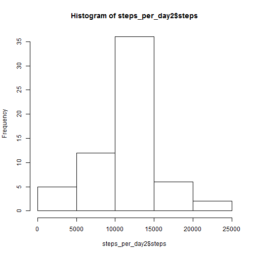

This is an R Markdown document. 
Github repo with RMarkdown source code: https://github.com/RemKamal/RepData_PeerAssessment1


```r
#setwd("repdata-data-activity");
activity_df <- read.csv("activity.csv")
```
# 1) What is the mean total number of steps taken per day?

### Make a histogram of the total number of steps taken each day


```r
activity_df$date <- as.Date(activity_df$date, "%Y-%m-%d")
steps_per_day <- aggregate(steps ~ date, data = activity_df, sum, na.rm = TRUE)
hist(steps_per_day$steps)
```

 

###Calculate and report the mean and median total number of steps taken per day

```r
mean(steps_per_day$steps)
```

```
## [1] 10766.19
```

```r
median(steps_per_day$steps)
```

```
## [1] 10765
```
# 2) What is the average daily activity pattern?

```r
steps_per_interval <- aggregate(steps ~ interval, data = activity_df, FUN = mean)
plot(steps_per_interval, type = "l")
```

 

### Which 5-minute interval, on average across all the days in the dataset, contains the maximum number of steps?

```r
steps_per_interval$interval[which.max(steps_per_interval$steps)]
```

```
## [1] 835
```
# 3) Imputing missing values

###Calculate and report the total number of missing values in the dataset (i.e. the total number of rows with NAs)

```r
sum(is.na(activity_df))
```

```
## [1] 2304
```
### Devise a strategy for filling in all of the missing values in the dataset. 
### Here is an example of the means for the 5-minute intervals as fillers for missing values.

```r
#Create a new dataset that is equal to the original dataset but with the missing data filled in.
activity_df <- merge(activity_df, steps_per_interval, by = "interval", suffixes = c("", 
    ".y"))
nas <- is.na(activity_df$steps)
activity_df$steps[nas] <- activity_df$steps.y[nas]
c <- activity_df[, c(1:3)]
#Make a histogram of the total number of steps taken each day and Calculate and report the mean and median total number of steps taken per day. 
steps_per_day2 <- aggregate(steps ~ date, data = activity_df, FUN = sum)
hist(steps_per_day2$steps)
```

 

```r
mean(steps_per_day2$steps)
```

```
## [1] 10766.19
```

```r
median(steps_per_day2$steps)
```

```
## [1] 10766.19
```

### Do these values differ from the estimates from the first part of the assignment? What is the impact of imputing missing data on the estimates of the total daily number of steps?

```r
#The impact is almost negligible for median, and obviously doesn't differ for the mean, because of the "mean method" being used to fill NA values
```

# 4) Are there differences in activity patterns between weekdays and weekends?

```r
#Create a new factor variable in the dataset with two levels -- "weekday" and "weekend" indicating whether a given date is a weekday or weekend day.
daytype <- function(date) {
    if (weekdays(as.Date(date)) %in% c("Saturday", "Sunday")) {
        "weekend"
    } else {
        "weekday"
    }
}
activity_df$daytype <- as.factor(sapply(activity_df$date, daytype))
#Make a panel plot containing a time series plot (i.e. type = "l") of the 5-minute interval (x-axis) and the average number of steps taken, averaged across all weekday days or weekend days (y-axis).
par(mfrow = c(2, 1))
for (type in c("weekend", "weekday")) {
    steps_per_type <- aggregate(steps ~ interval, data = activity_df, 
                            subset = activity_df$daytype == type, FUN = mean)
    plot(steps_per_type, type = "l", main = type)
}
```

 
